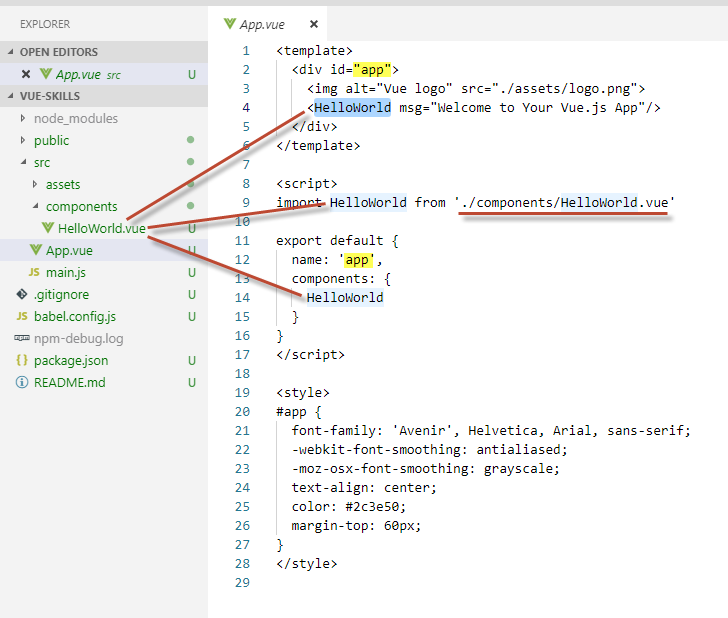

# Lesson 1
## Installing Vue with the Vue CLI
- [source](https://coursetro.com/posts/code/133/How-to-Install-Vue-2---Through-CDN,-NPM-and-the-Vue-CLI) Used by the tutorial.
- `npm -v` find what version your using
- Update NPM on Windows [github](https://stackoverflow.com/questions/18412129/how-can-i-update-npm-on-windows)
- `npm install -g @vue/cli`
- ` vue create vue-skills`
`PS D:\Github\vue-js-2-by-example> vue create vue-skills
> You are using Node v4.6.0, but this version of vue-cli > requires Node >=8.9.
> Please upgrade your Node version.

## Launch and run the server with NPM
- `npm run serve`

### App running at:
- Local: `http://localhost:8080/`
- network: unavailable

## Vue CLI
- [install Vue through NPM](https://coursetro.com/posts/code/133/How-to-Install-Vue-2---Through-CDN,-NPM-and-the-Vue-CLI) 
- NPM=Node Package Manager; Not used in the tutorial

# Lesson 2 Startup and Over vier

## App.vue

## App.vue Hello World

### Change HelloWorld to Skills

### App-vue-modifications

### npm-run-serve_debugging-example
NOT SHOWN

# Lesson3 Templating - Interpolation and Directives
- [notes](https://coursetro.com/courses/23/Vue-Tutorial-in-2018---Learn-Vue.js-by-Example/lessons/3)
- Interprelation aka mustaches
- Text Interprelation
- JavaScript Interprelation

## Template and Script example

## v-for directive and som Json-data

## App-vue with scoped and without scope

## Add Skills.css file reference vai style src

# v-bind directive
## v-bind-class

## v-bind-class multiple directives

## v-bind-class to a JSON object

## v-bind to a style

## updated styles in App.vue and Skills.vue
**ToDo**: what's special about this?

## form v-model directive methods
- [see](https://vuejs.org/v2/guide/events.html)

## form with two input fields

## Appendix Vue Directives (most common)
  v-text
  v-html
  v-show
  v-if
  v-else
  v-else-if
  v-for
  v-on
  v-bind
  v-model
  v-pre
  v-cloak
  v-once

- [Class and Style Binding](https://coursetro.com/posts/code/136/Vue-CSS-Tutorial---Class-and-Style-Binding)

## Vue Class binding
uses a bind directive

## style binding

## vee-validate
- **vee-validate** Input validation for Vue.js, [see](https://baianat.github.io/vee-validate/)
- `npm install vee-validate --save`
-

### Vue Devtools extension 
-  [github](https://github.com/vuejs/vue-devtools) extension has install for **Chrome** Extension (beta), **Firefox** Addon (beta) and stadalone **Electron** app (works with any environment!)

# Validation

## install vee-validate

## vue-validate example

# Animations
- e.g. enter and leave
- Custom component wrapper `transition`
- The name of the transition e.g. alert-in will server as a prefix to some css animation classes
- transition can deal with certain type of directives e.g. `v-if`, `v-show`, _dynamic components_ and _component group nodes_
- Available transition class for Vue [see](https://vuejs.org/v2/guide/transitions.html)
   `v-enter, v-enter-active, v-enter-to, v-leave, v-leave-active, v-leave-to`
    
## 3rd Party Animation Library 
- **Animate.css** [demo](https://daneden.github.io/animate.css/)

## animations using transition-class

## animations using _Annimation.css_ 3rd party library

### Animating List
via transition group

# Routing [see](https://router.vuejs.org/installation.html)
- `npm install vue-router`
- this could have been created for me when I did the initial `vue create` command

## npm install vue-router

## routing changes

Left off [here](https://youtu.be/78tNYZUS-ps?t=3609) in the Video

# More Samples
- [StupidTodo](https://github.com/DaneVinson/StupidTodo) by DaneVinson, example uses no NPM, [blog](https://developingdane.com/vue-js/)
- [Vue and TypeScript](https://johnpapa.net/vue-typescript/) by John Papa

### ToDo - move to another md file
- cheat-sheet.png
- 11-8-2018 9-57-57 AM